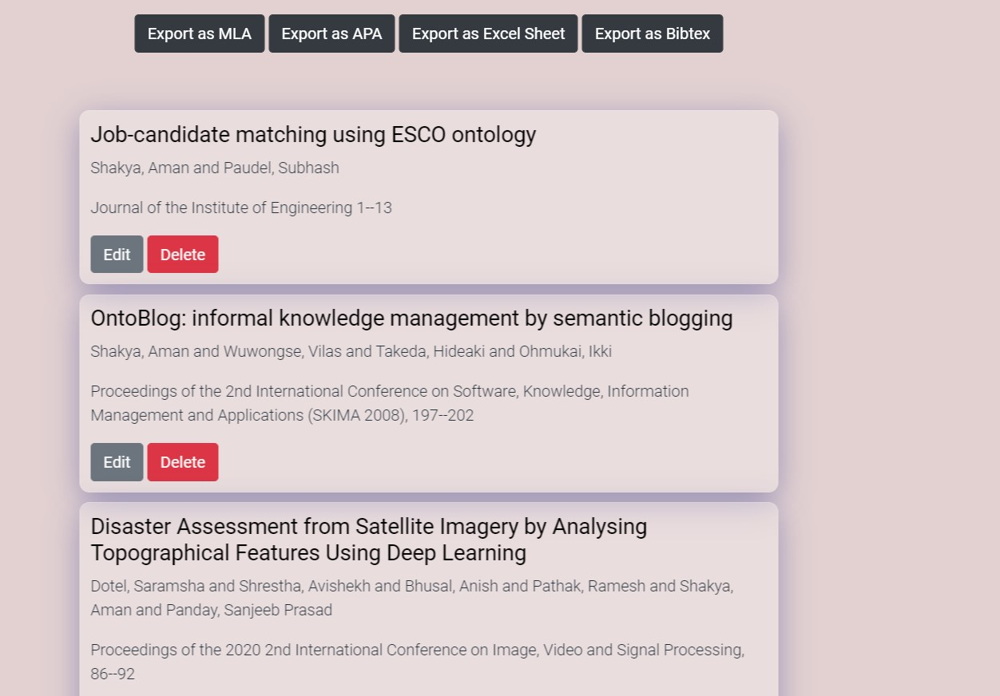

<!-- PROJECT LOGO -->
<br />
<p align="center">
  <a href="https://github.com/othneildrew/Best-README-Template">
    
  </a>

  <h1 align="center">Personal Publication Repository</h1>

  <p align="center">
    A software engineering project by team x86
    <br />
    <br />
    <br />
    <a href="https://mypubrepo.herokuapp.com/">View Demo</a>
    ·
    <a href="https://github.com/JanakSharma2055/Publication-Repository.git">Report Bug</a>
    ·
    <a href="https://github.com/JanakSharma2055/Publication-Repository.git">Request Feature</a>
  </p>
</p>


<!-- TABLE OF CONTENTS -->
<details open="open">
  <summary>Table of Contents</summary>
  <ol>
    <li>
      <a href="#about-the-project">About The Project</a>
      <ul>
        <li><a href="#built-with">Built With</a></li>
      </ul>
    </li>
    <li>
      <a href="#getting-started">Getting Started</a>
      <ul>
        <li><a href="#prerequisites">Prerequisites</a></li>
        <li><a href="#installation">Installation</a></li>
      </ul>
    </li>
    <li><a href="#usage">Usage</a></li>
    <li><a href="#license">License</a></li>
    <li><a href="#contact">Contact</a></li>
  </ol>
</details>


<!-- ABOUT THE PROJECT -->
## About The Project


This is the project by student group of 075BCTAB. A software engineering project that is created using django as backend and bootstrap, html and css as frontend. 


### Built With

These are major dependencies for our project
* [Bootstrap](https://getbootstrap.com)
* [Python](https://docs.python.org/3/)
* [Django](https://docs.djangoproject.com/en/3.2/)


<!-- GETTING STARTED -->
## Getting Started

You can run this project locally.
### Or you can check demo from above view demo link

## Prerequisites

The project depends on:
* Python version 3.8.2 
* Bootstrap version 5.0

  You can check requirement file for other dependencies


## Installation

Use the package manager pip to install virtualenvironment

```bash
pip install virtualenvwrapper-win
```

_You can use any virtual environment of your choice.The steps below are for virtual environment wrapper_

1. First create a virtual environment using ```mkvirtualenv <env name>```
2. Inside the virtual environment Clone the repo
   ```sh
   git clone https://github.com/your_username_/Project-Name.git
   ```
3. install dependencies using ```pip install -r requirements.txt```
4. make migrations using  ```python manage.py makemigrations```
5. run command ```python manage.py runserver```
6. The project will be hosted in local host  ```http://127.0.0.1:8000/```


<!-- USAGE EXAMPLES -->
# Usage

Some of the screenshots from the project are shown below:


This is signup page. You first need to create your account.


<hr>


This page contains list of all the articles you have created. Different export options are available. You can export your articles in MLA, APA ,Bibtex format as well as you can create excel dump.Delete and Edit features for the entries are provided as well. The sample for bibtex export is shown below:


_For more examples, please refer to the [Documentation](https://example.com)_

Documentation is yet to be created


<!-- CONTRIBUTING -->
## Contributing
The project is not open for contribution for now. In future you can follow the following steps to contribute to the project

**Any contributions you make are greatly appreciated**

1. Fork the Project
2. Create your Feature Branch (`git checkout -b feature/AmazingFeature`)
3. Commit your Changes (`git commit -m 'Add some AmazingFeature'`)
4. Push to the Branch (`git push origin feature/AmazingFeature`)
5. Open a Pull Request


<!-- LICENSE -->
## License

Distributed under the MIT License. See `LICENSE` for more information.


<!-- CONTACT -->
## Contact

Janak Sharma  - janaksharma2075@gmail.com

Bishal Bashyal - bishalbashyal33@gmail.com

Dimple saraogi - example@gmail.com

Bishal Katuwal - bis3hal@gmail.com
               - 075BCT028.bishal@pcampus.edu.np


